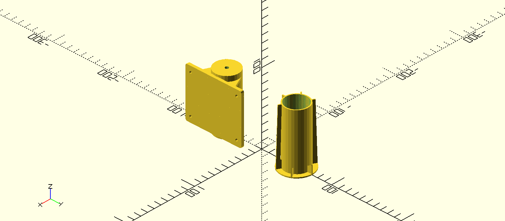

# 7-inch-monitor-stand-addapter

A 3D-printable adapter that lets a 7-inch monitor mount onto a standard
stand/mount instead of whatever mount (or lack of one) it shipped with.

## Files

- `stand-monitor-adapter.scad` — OpenSCAD source (parametric — edit
  dimensions here if your monitor's mounting holes differ)
- `stand-monitor-adapter-bottom.stl`, `stand-monitor-adapter-top.stl`,
  `stand-monitor-adapter-top-portrait.stl` — ready-to-print STL exports;
  the "portrait" variant rotates the mount 90° for a vertical monitor
  orientation

## Printing

No specific print settings are documented — standard PLA/PETG settings for
a functional mechanical bracket (0.2mm layer height, 20%+ infill, a brim if
your printer struggles with small first-layer contact area) should be fine.
If your monitor's VESA/mount hole spacing differs from what these STLs
assume, edit `stand-monitor-adapter.scad` in [OpenSCAD](https://openscad.org/)
and re-export.
